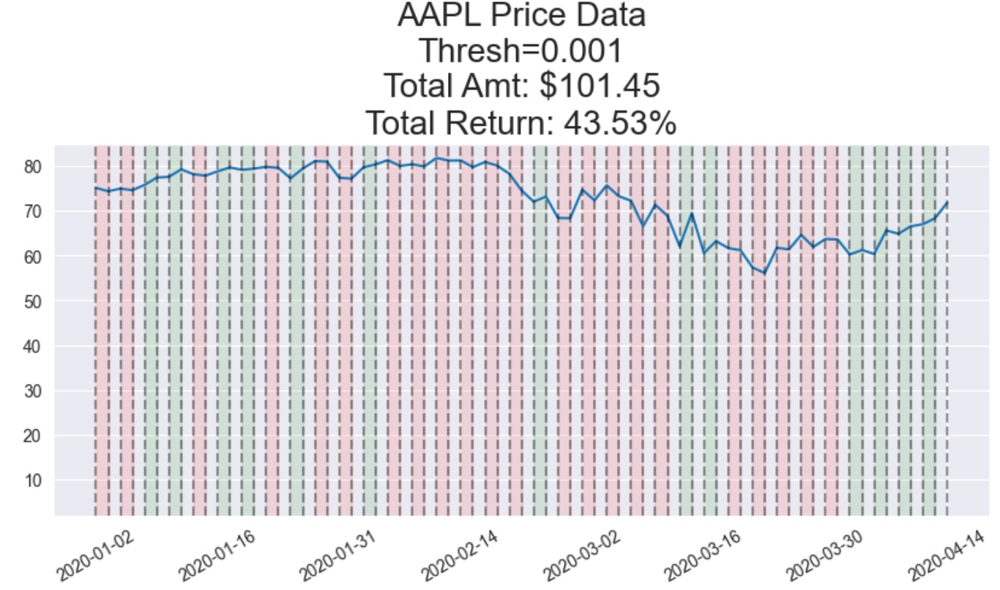
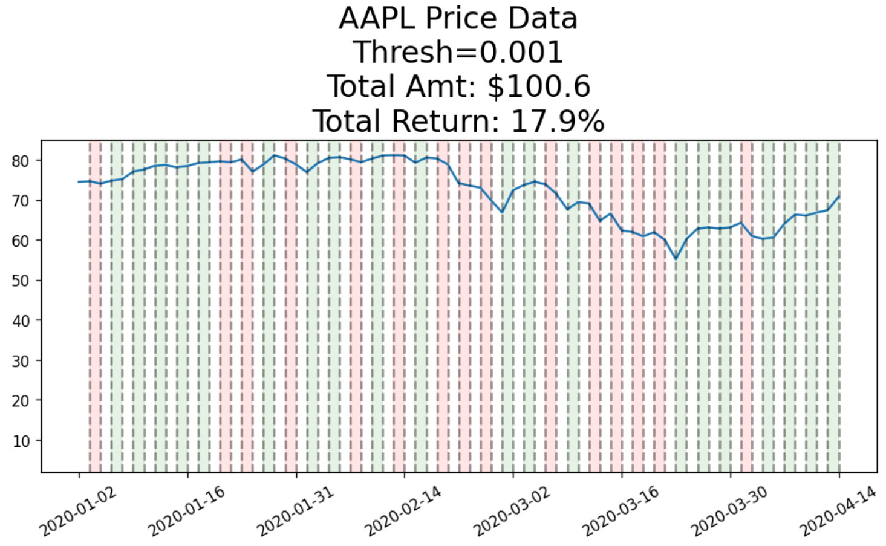

# Financial-Forecasting-with-Timeseries

**Team Members :** Antony Carrard, Killian Vervelle

## Project: Financial-Forecasting-with-Timeseries

In this project, we aimed to leverage a combination of time series forecasting techniques and machine learning models to predict the stock price variations of Apple, and ultimately implement a trading bot capable of generating a return on investments. As stock market prices exhibit a random walk (Fama, 1995), predicting both the magnitude and directional changes of stock prices remains one of the most challenging tasks in financial forecasting (Meher et al., 2021). Accurate predictions are crucial for investors as they enable informed decisions for future investments. Therefore, the goal of this study is to create a reliable forecasting model that investors can confidently rely on to optimize their investment strategies.

### Data source

The data utilized in this project has been sourced from https://finance.yahoo.com/quote/AAPL/history/, a rich resource of financial market data and tools to find compelling investments.

### Stock Price Predicition using ARIMA and LSTM

We explored two distinct forecasting models: ARIMA (AutoRegressive Integrated Moving Average) and LSTM (Long Short-Term Memory) to predict short-term stock price movements:

- ARIMA is a traditional time series model widely used for forecasting stock prices. It models the linear relationships in the data, making it well-suited for predicting mid- to long-term trends. ARIMA works by analyzing past prices and uncovering underlying trends that can be extended into the future.

- LSTM is a deep learning model specifically designed for time series forecasting. It captures both linear and non-linear patterns in the data, making it effective for predicting short-term price variations in a complex and volatile market.
Goal: By comparing these models, we aim to determine the most accurate forecasting technique for Nestlé's daily stock price.

### Stock Market Forecasting Challenges

Random Walk Theory suggests that stock prices follow a random and unpredictable path, making accurate predictions extremely challenging. Despite this, investors constantly seek tools that help them anticipate price movements.

One of the core challenges of this project is to overcome the randomness in stock price behavior and accurately predict directional changes and magnitude. Through the use of ARIMA and LSTM, we aim to reduce prediction errors and provide reliable forecasting for investment decisions.

### Design and Implementation of a Traiding Bot

Based on the best-performing prediction model (ARIMA or LSTM), we designed an automated trading bot that could execute buy/sell decisions based on the forecasted stock prices.

The bot follows a traiding strategy where it buys stock when prices are predicted to rise and sells when prices are predicted to fall. This is a simple trend-following approach that is enhanced by the accuracy of the forecasting model.

Futur improvements could include risk management strategies to minimize potential losses, such as stop-loss mechanisms, and position sizing rules to optimize trades and maintain a balanced risk-return profile.

### ARIMA results with Training Bot

    

The ARIMA-driven trading bot performed reasonably well for longer-term trend following but was less effective for short-term trading due to its slower reaction to rapid market movements.

### LSTM results with Training Bot

    

The LSTM-driven trading bot delivered consistent returns by effectively capitalizing on short-term price movements, outperforming traditional buy-and-hold strategies and the ARIMA-based bot.

### Conclusion

This study demonstrated the potential of ARIMA and LSTM in forecasting stock prices, each with its own strengths: ARIMA for capturing longer-term trends and LSTM for modeling short-term volatility and non-linear patterns.

By designing and implementing an automated trading bot, we showed that investors could potentially rely on these models to make informed investment decisions and achieve favorable returns in a highly dynamic market.

While this project provided valuable insights into stock price prediction, continued refinement and testing are necessary to further improve the accuracy and profitability of the trading bot in real-world conditions. 

